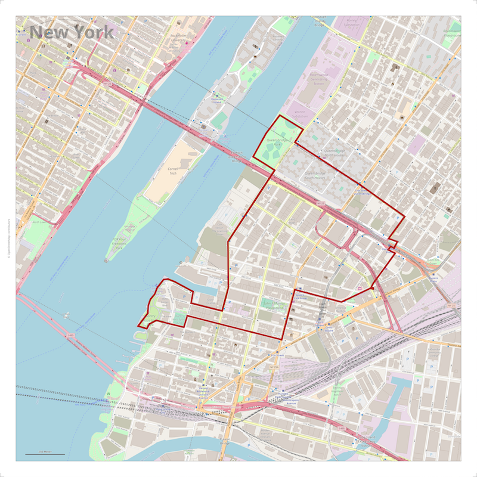

# Printmaps Webservice

Printmaps ist ein Webservice der die Erstellung großformatiger, OSM-basierter Karten in Druckqualität erlaubt. Die Karte kann dabei um beliebige Benutzerelemente und Benutzerdaten ergänzt werden.

* großformatige Karten in Druckqualität
* verschiedene Kartenstile (osm-carto, schwarzplan+, ...)
* verschiedene Dateiformate (png, pdf, svg)
* aktuelle OpenStreetMap-Kartendaten
* Kartendaten verfügbar für die gesamte Erdoberfläche
* benutzerdefinierte Zusatzelemente (Rahmen, Gitter, Legende, Maßstabsbalken, ...)
* benutzerdefinierte Datenobjekte (gpx, kml, shape, geojson, csv, ...)
* wählbare Kartenabbildung (EPSG:3857, EPSG:32632, EPSG:27700, EPSG:2056, ...)

Printmaps kann genutzt werden

* als Webservice
* via Printmaps-CLI-Client

## Funktionsweise

Der Benutzer definiert zunächst lokal eine Printmaps-Steuerdatei (map.yaml), die anschließend unter einer eindeutigen ID serverseitig gespeichert wird. Die Steuerdatei legt fest, wie die zu rendernde Karte aussehen soll. Hierbei kann der Benutzer die Karte um individuellle Objekte (Benutzerdaten) ergänzen. Für die Interaktion mit dem Benutzer ist der Webservice zuständig. Die eigentliche Erzeugung der Karte übernimmt der Buildservice. Der Buildservice generiert aus der Printmaps-Steuerdatei eine individuelle Mapnik-Steuerdatei (mapnik.xml). Hierbei wird die Mapnik-Steuerdatei um die Vorschriften zur Darstellung der Karten- und Benutzerzusatzelemente ergänzt. Anschließend wird die Karte durch das Programm Mapnik (via Nik4) erzeugt. Der Buildservice läuft dabei unabhängig vom Webservice. Über den Webservice hat der Benutzer jedoch die Möglichkeit, den jeweils aktuellen Buildstatus zu erfragen. Ist die Karte fertig gerendert, kann sie via Webservice herunter geladen werden.

## Status

Printmaps befindet sich aktuell im Status Pre-Release "beta2-1 (release candidate)".

## Wie anfangen

* durcharbeiten der Webseite [Printmaps Website](http://printmaps-osm.de:8080/)
* erzeugen einiger Karten mit dem Printmaps-CLI-Client
* sich vertraut machen mit den Printmaps-Eigenschaften und -möglichkeiten
* aufsetzen einer (minimalen) eigenen Printmaps-Testumgebung (ohne DB)
* aufsetzen einer (vollumfänglichen) Printmaps-Umgebung (mit DB)

## Printmaps besteht aus folgenden Komponenten

### Server (printmaps_webservice, printmaps_buildservice, Nik4)

* printmaps_webservice
* printmaps_buildservice
* Nik4

Siehe README.md in den entsprechenden Verzeichnissen.

### Client (printmaps_client)

Siehe README.md im printmaps_client-Verzeichnis.

### Kartenstile (printmaps_styles)

* osm-carto
* raster10
* schwarzplan
* schwarzplan+

Siehe README.md im printmaps_styles-Verzeichnis.

### Icons (printmaps_icons)

Siehe README.md im printmaps_icons-Verzeichnis.

### Pattern (printmaps_pattern1, printmaps_pattern2)

Siehe README.md in den entsprechenden Verzeichnissen.

### Datenpflege (printmaps_updater, printmaps_purger)

* printmaps_updater
* printmaps_purger

Siehe README.md in den entsprechenden Verzeichnissen.

### Webseite (printmaps-osm.de)

Siehe README.md im printmaps-osm.de-Verzeichnis.

## Empfohlene (Server-) Verzeichnisstruktur

    printmaps
        printmaps
            orders
            maps
        printstyles
            markers
            osm-carto
            osm-carto-ele
            osm-carto-mono
            raster10
            schwarzplan
            schwarzplan+
        printdata
            updater
            purger
        Nik4

## Vorbedingungen der Serverumgebung

Folgende Programme und Tools müssen installiert sein:

* python
* mapnik
* mapnik-utils
* python-mapnik
* zip

Beispiel für Ubuntu:

    sudo apt install python 
    sudo apt install libmapnik3.0 libmapnik-dev mapnik-utils python-mapnik
    sudo apt install zip

## Test der Serverumgebung

Es empfiehlt sich, zunächst mit einer minimalen Serverumgebung (ohne Datenbank) zu starten:

    printmaps
        printmaps
            orders
            maps
        printstyles
            markers
            raster10
        Nik4

Folgende Konfiguration sind anzupassen:

* printmaps_webservice.yaml
* printmaps_buildservice.yaml

Desweiteren ist in der Kartenkonfiguration (map.yaml für den CLI-Client) die URL der Testumgebung einzutragen.

---

## (Browser-) Web-Applikation

Für Printmaps steht mit dem Printmaps-CLI-Client eine vollumfängliche, kommandozeilenorientierte Bedienoberfläche zur Verfügung.
Wünschenswert wäre eine zusätzliche grafische Benutzeroberfläche in Form einer (Browser-) Web-Applikation.
Möglicherweise ist jemand interessiert etwas in dieser Richtung zu entwickeln und zu veröffentlichen (gerne in diesem Repository).
Hier einige Ideen dazu:

Grundsätzlich:

* die Web-Applikation sollte sich auf HTML5 und JavaScript beschränken
* die Web-Applikation (GUI) sollte keine Serverkomponenten benötigen
* Kartendefinitionen (map.yaml) sollten lokal gespeichert werden können

Oberfläche:

* Menüpunkte: Überblick, Daten, Karte, Aktion, Hilfe, Impressum
* Überblick: allgemeine Erläuterungen (Zweck, Nutzung, ...)
* Daten:
  * Kartendefinition gemäß map.yaml
  * Laden und Speichern möglich
* Karte:
  * Anzeigen des definierten Kartenausschnittes
  * Verschieben des Kartenausschnittes möglich
* Aktion:
  * order, state, download
  * upload, create, etc. automatisch im Hintergrund
* Hilfe: Erläuterung und Details zur Funktionsweise
* Impressum: Impressum

Anmerkungen:

* Die von der Weboberfläche erzeugte Kartendefinitionsdatei "map.yaml" sollte auch vom CLI-Client verwendet werden können und umgekehrt.
* Die Datei "map.id" ist ebenfalls zu speichern und zu laden.

---

to be done - english translation
